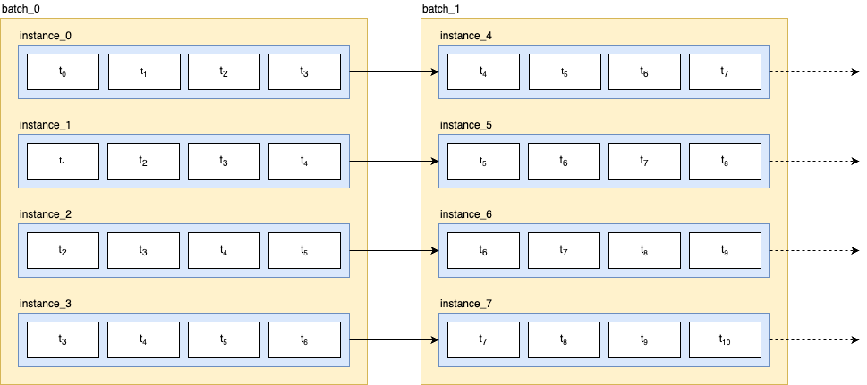

# LSTM Forecaster

The primary objective of this repository is to provide an implementation of **stateful LSTM** regression model using **PyTorch**.

During the model development and training phase for the [2024 Green Battery Hackathon](https://www.mlai.au/hackathon), I came across the concept of **Stateful LSTM**.
While [TensorFlow](https://www.tensorflow.org/api_docs/python/tf/keras/layers/LSTM) offers an easy implementation of stateful LSTM by simply setting `stateful=True`, as a [PyTorch](https://pytorch.org/) user, I found limited resources, documentation, and implementations related to creating stateful LSTM models.

Consequently, after conducting thorough research, I decided to create my own implementation of stateful LSTM using PyTorch and share the resualt of my work.

## Setup

1. Clone the project repository to your local machine
2. Move to the repository
   ```bash
   cd lstm-forecast
   ```
3. This project is managed using [Poetry](https://python-poetry.org/). If Poetry isn't installed on your machine, please run the command bellow to install Poetry

   - Linux, macOS, Windows (WSL)

   ```bash
   curl -sSL https://install.python-poetry.org | python3 -
   ```

   - Windows (Powershell)

   ```bash
   (Invoke-WebRequest -Uri https://install.python-poetry.org -UseBasicParsing).Content | py -
   ```

   Checkout the [instructions](https://python-poetry.org/docs/#installing-with-the-official-installer) on Poetry's documentation for further information.

4. Install the dependencies
   ```bash
   poetry install
   ```

- Train

  Train the model by executing `train_runner.py`

  ```bash
  python train_runner.py
  ```

- Test

  All the unit test is located at [`test/`](./test/). To run the test, execute:

  ```bash
  python -m pytest
  ```

## Stateful LSTM

Stateful LSTM is a variant of the Long Short-Term Memory (LSTM) model. In a standard LSTM model, the hidden state and cell state are reset after each sequence or batch of data is processed. However, in a stateful LSTM, the hidden state and cell state are preserved between batches or sequences.
This means that the final hidden state and cell state from one batch or sequence become the initial hidden state and cell state for the next batch or sequence. This preservation of state allows the model to maintain memory beyond batches or sequences. By retaining information from previous batches or sequences, the stateful LSTM can capture longer-term dependencies in the data.
Stateful LSTMs are particularly useful when dealing with data that has a clear temporal structure, such as time series data or sequences of text.
They can help improve the model's ability to learn patterns and relationships in the data over time, leading to more accurate predictions or classifications.

### Implementation

The [TensorFlow documentation](https://www.tensorflow.org/api_docs/python/tf/keras/layers/LSTM) defines stateful as:

> Boolean (default: False).
> If True, the last state for each sample at index i in a batch will be used as initial state for the sample of index i in the following batch.

This can be illustrated in the figure bellow:



The hidden and cell state are preserved through each epoch. At the start of each epoch, the hidden and cell state are initialised to 0.

To align the data in the correct order, there are some key points to keep in mind:

1. Preserve the data order: `shuffle = False`
2. **Batch size** should be equal to **time window size**: `batch_size = time_serise_window_size`
3. **Dataloader** `drop_last = True`: This is to ensure the consistency of batch sizes through out the training loop.

## Dataset

The datasets were data collected and provided by the 2024 Green Battery Hackathon.

- `timestamp`: The time this row was recorded.
- `price`: The electricity spot price for South Australia in $/MWh. Provided by [opennem](https://opennem.org.au/).
- `demand`: The total electricity demand in MW for South Australia for large stable consumers (e.g. factories, mines, etc.) in MW. Provided by the legends at [opennem](https://opennem.org.au/).
- `temp_air`: The air temperature in degrees Celsius in an indicative location in South Australia.
- `pv_power`: The rate of power generated by the simulated solar panel in kW. Provided by [solcast](https://solcast.com/).
- `pv_power_forecast_1h`: A forecast of what the `pv_power` will be in 1 from the `timestamp`. This data is missing for the first 2 years of training data. Provided by [solcast](https://solcast.com/).
- `pv_power_forecast_2h`: A forecast of what the `pv_power` will be in 2 from the `timestamp`. This data is missing for the first 2 years of training data. Provided by [solcast](https://solcast.com/).
- `pv_power_forecast_24h`: A forecast of what the `pv_power` will be in 24 from the `timestamp`. This data is missing for the first 2 years of training data. Provided by [solcast](https://solcast.com/).
- `pv_power_basic`: An estimate of the rate of solar power that is currently being generated across the whole state of South Australia. This data is missing for the first 2 years of training data. Provided by [solcast](https://solcast.com/).

## References

- [Stateful LSTM in Keras](https://philipperemy.github.io/keras-stateful-lstm/)
- [Stateful and Stateless LSTM for Time Series Forecasting with Python](https://machinelearningmastery.com/stateful-stateless-lstm-time-series-forecasting-python/)
- [Stateful LSTM on time series (pytorch)](https://www.kaggle.com/code/viliuspstininkas/stateful-lstm-on-time-series-pytorch)
